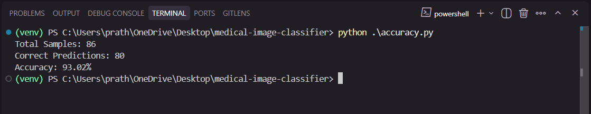

# 🧠 Medical vs Non-Medical Image Classifier

A production-ready, end-to-end deep learning solution for classifying images as **medical** or **non-medical** using a fine-tuned ResNet-50 model. This system supports multiple medical imaging modalities and provides both API and web interfaces for seamless integration.

[](https://python.org)
[](https://pytorch.org)
[](LICENSE)

## ✨ Key Features

- 🏥 **Multi-Modal Support**: Trained on X-ray, CT, MRI, and Ultrasound images
- 📄 **PDF Processing**: Automatically extracts and classifies images from PDF documents
- 🌐 **URL Support**: Process images directly from web URLs
- 🚀 **Dual Interface**: REST API for integration + Interactive web UI for testing
- 🎯 **Confidence Thresholding**: Smart detection of non-medical images
- ⚡ **In-Memory Processing**: Efficient handling without temporary file storage
- 🔧 **Production Ready**: Comprehensive error handling and logging

## 🏗️ Architecture Overview

```
Input Sources          Processing Pipeline         Output
┌─────────────┐       ┌─────────────────────┐    ┌──────────────┐
│ Image Files │────►  │                     │    │              │
│ PDF Files   │────►  │   ResNet-50 Model   │───►│ Classification│
│ Web URLs    │────►  │   (Fine-tuned)      │    │ + Confidence │
└─────────────┘       └─────────────────────┘    └──────────────┘
```

## 🚀 Quick Start

### Prerequisites
- Python 3.8 or higher
- pip package manager
- 4GB+ RAM recommended

### Installation

1. **Clone the repository**
   ```bash
   git clone <repository-url>
   cd medical-image-classifier
   ```

2. **Install dependencies**
   ```bash
   pip install -r requirements.txt
   ```

3. **Download pre-trained model** (if not included)
   ```bash
   # Model file: best_resnet_medical_classifier.pth should be in root directory
   ```

4. **Start the application**
   ```bash
   python start_app.py
   ```

### Alternative Setup Options

**Option 1: API Only**
```bash
python app.py
```

**Option 2: Web UI Only**
```bash
streamlit run app_streamlit.py
```

**Option 3: Command Line Interface**
```bash
python run_pipeline.py <pdf_path_or_url>
```

## 📖 Usage Guide

### 🌐 Web Interface

1. Navigate to `http://localhost:8501`
2. Choose input method:
   - **Upload File**: Drag & drop images or PDFs
   - **Enter URL**: Paste direct links to images or PDFs
3. View results with confidence scores and image previews

### 🔌 REST API

**Base URL**: `http://127.0.0.1:5000`

#### Endpoint: `/predict`
**Method**: `POST`

**Option 1: File Upload**
```bash
curl -X POST -F "file=@sample.jpg" http://127.0.0.1:5000/predict
```

**Option 2: URL Processing**
```bash
curl -X POST -H "Content-Type: application/json" \
     -d '{"url": "https://example.com/medical-scan.pdf"}' \
     http://127.0.0.1:5000/predict
```

**Response Format**:
```json
{
  "status": "success",
  "results": [
    {
      "image": "image_name.jpg",
      "prediction": "medical (x-ray)",
      "confidence": 0.9234
    }
  ]
}
```

### 🖥️ Command Line Interface

**Process PDF or URL**:
```bash
python run_pipeline.py path/to/document.pdf
python run_pipeline.py https://example.com/medical-images.pdf
```

**Single Image Classification**:
```bash
python predict.py
# Enter image path when prompted
```

## 🎯 Model Architecture & Performance

### Model Specifications
- **Base Architecture**: ResNet-50 (torchvision)
- **Input Size**: 224x224 RGB images
- **Classes**: 4 medical modalities + non-medical detection
- **Framework**: PyTorch 2.0+
- **Optimization**: AdamW optimizer with learning rate 2e-5

### Training Configuration
```python
NUM_CLASSES = 4
BATCH_SIZE = 16
EPOCHS = 15
LEARNING_RATE = 2e-5
THRESHOLD = 0.85
IMAGE_SIZE = 224
```

### Supported Medical Modalities
- 🦴 **X-ray**: Radiographic images
- 🧠 **CT Scan**: Computed tomography
- 🔬 **MRI**: Magnetic resonance imaging
- 🫀 **Ultrasound**: Sonographic images

## 📊 Training Datasets

The model was trained on high-quality medical imaging datasets from Kaggle, ensuring robust performance across different medical modalities:

### Dataset Sources

| Modality | Dataset | Description | Images | Link |
|----------|---------|-------------|---------|------|
| 🫀 **Ultrasound** | Ultrasound Fetus Dataset | Fetal ultrasound images for medical training | ~2,000+ | [Kaggle Dataset](https://www.kaggle.com/datasets/orvile/ultrasound-fetus-dataset) |
| 🧠 **CT Scan** | CT Scan Images | Comprehensive CT scan collection | ~1,500+ | [Kaggle Dataset](https://www.kaggle.com/datasets/orvile/ct-scan-images) |
| 🔬 **MRI** | Brain MRI Images | Brain MRI scans for neurological analysis | ~3,000+ | [Kaggle Dataset](https://www.kaggle.com/datasets/ashfakyeafi/brain-mri-images) |
| 🦴 **X-ray** | Labeled Chest X-ray Images | Chest radiographs with medical annotations | ~5,000+ | [Kaggle Dataset](https://www.kaggle.com/datasets/tolgadincer/labeled-chest-xray-images) |

### Dataset Characteristics

**Data Quality & Preprocessing**:
- All images normalized to 224x224 RGB format
- Medical-grade image quality from clinical sources
- Balanced distribution across modalities
- Comprehensive data augmentation applied during training

**Training Split**:
- **Training Set**: 80% of total dataset
- **Validation Set**: 20% of total dataset
- **Cross-validation**: Stratified sampling to maintain class balance

**Data Diversity**:
- Multiple anatomical regions covered
- Various imaging conditions and equipment
- Different patient demographics represented
- Clinical-grade annotations and labels

## 🧪 Model Testing & Validation

### Independent Test Results

The model was evaluated on a separate test dataset to validate its real-world performance:



### Test Dataset Specifications

| Metric | Value |
|--------|-------|
| **Total Test Images** | 86 |
| **Medical Images** | Mixed modalities (X-ray, CT, MRI, Ultrasound) |
| **Non-Medical Images** | Various everyday objects and scenes |
| **Final Accuracy** | **93.02%** |
| **Test Method** | Independent validation set |

## 🔧 Configuration

### Environment Variables
```bash
# Optional: Set device preference
export DEVICE="cuda"  # or "cpu"

# Optional: Adjust confidence threshold
export THRESHOLD="0.85"
```

### Custom Training
To retrain the model with your own data:

1. **Organize your dataset**:
   ```
   images/
   ├── ct-scan/
   ├── mri/
   ├── ultrasound/
   └── x-ray/
   ```

2. **Start training**:
   ```bash
   python train_resnet.py
   ```

3. **Monitor progress**: Training logs show loss and validation accuracy

## 🧪 Testing & Validation

### API Testing with curl
```bash
# Test image upload
curl -X POST -F "file=@test_image.jpg" http://127.0.0.1:5000/predict

# Test URL processing
curl -X POST -H "Content-Type: application/json" \
     -d '{"url": "https://example.com/scan.pdf"}' \
     http://127.0.0.1:5000/predict
```

### Batch Processing
```bash
# Process multiple files
python run_pipeline.py document1.pdf
python run_pipeline.py https://medical-site.com/scans.pdf
```

## 🚨 Error Handling

The system handles various error scenarios:
- **Unsupported file formats**: Returns clear error messages
- **Network timeouts**: Graceful handling of URL fetch failures
- **Corrupted files**: Validation and error reporting
- **Memory constraints**: Efficient processing for large files

## 🤝 Contributing

1. Fork the repository
2. Create a feature branch
3. Commit your changes
4. Push to the branch
5. Open a Pull Request
